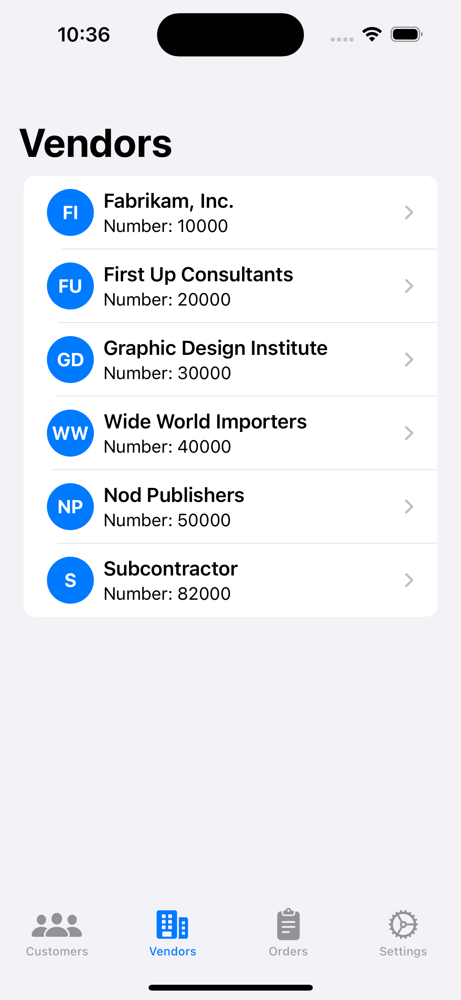

# BCConnector

BCConnector is a powerful SwiftUI application that seamlessly integrates with Microsoft Dynamics 365 Business Central, providing users with a user-friendly interface to view and manage customers, vendors, and orders on iOS devices.

<p align="center">
  
  
  
  
</p>

## Features

- **Secure Authentication**: Utilizes Microsoft Azure AD for robust and secure user authentication.
- **Customer Management**: 
  - View a comprehensive list of customers
  - Access detailed customer information
  - Visualize customer locations on an interactive map
- **Vendor Management**:
  - Browse through the list of vendors
  - View detailed vendor information
  - Locate vendors on an interactive map
- **Order Tracking**: Access and view order information directly from Business Central.
- **Interactive Map Integration**: Visualize customer and vendor addresses on an interactive map for better geographical context.
- **Settings Management**: Easily configure and manage Business Central connection settings within the app.

## Requirements

- iOS 15.0 or later
- Xcode 13.0 or later
- Swift 5.5 or later
- Active Microsoft Dynamics 365 Business Central account

## Installation

1. Clone the repository:
   ```
   git clone https://github.com/yourusername/BCConnector.git
   ```
2. Navigate to the project directory:
   ```
   cd BCConnector
   ```
3. Open the project in Xcode:
   ```
   open BCConnector.xcodeproj
   ```
4. Build and run the project in Xcode.

## Configuration

Before using the app, you need to configure your Business Central settings:

1. Launch the app and navigate to the Settings tab.
2. Enter your Business Central credentials:
   - Client ID
   - Client Secret
   - Tenant ID
   - Company ID
   - Environment
   - Redirect URI

Ensure all fields are filled correctly for the app to function properly.

## Usage

1. Launch the app and log in using your Microsoft account associated with Business Central.
2. Once authenticated, you'll have access to the main features:
   - **Customers**: View customer list, access detailed information, and see locations on a map.
   - **Vendors**: Browse vendors, view detailed information, and visualize locations.
   - **Orders**: Access and view order information from Business Central.
   - **Settings**: Configure and manage your Business Central connection settings.
3. Tap on any customer or vendor to view more details and see their location on the map.

## API Pages

The BCConnector app requires certain API Pages to be created via an app extension. These API Pages can be found in the following repository:

[BCAPIForIosApp](https://github.com/yannstlo/BCAPIForIosApp)

Please follow the instructions in the BCAPIForIosApp repository to set up the necessary API Pages for your BCConnector app. These API Pages are essential for the app to function properly and connect to the required data sources.

## Contributing

We welcome contributions to the BCConnector project! If you'd like to contribute, please follow these steps:

1. Fork the repository
2. Create your feature branch (`git checkout -b feature/AmazingFeature`)
3. Commit your changes (`git commit -m 'Add some AmazingFeature'`)
4. Push to the branch (`git push origin feature/AmazingFeature`)
5. Open a Pull Request

Please ensure your code adheres to the project's coding standards and includes appropriate tests.

## License

This project is licensed under the MIT License - see the [LICENSE](LICENSE) file for details.

## Support

If you encounter any issues or have questions, please file an issue on the GitHub repository.

## Acknowledgements

- SwiftUI for providing a powerful framework for building user interfaces
- Microsoft for their Dynamics 365 Business Central platform and authentication services
